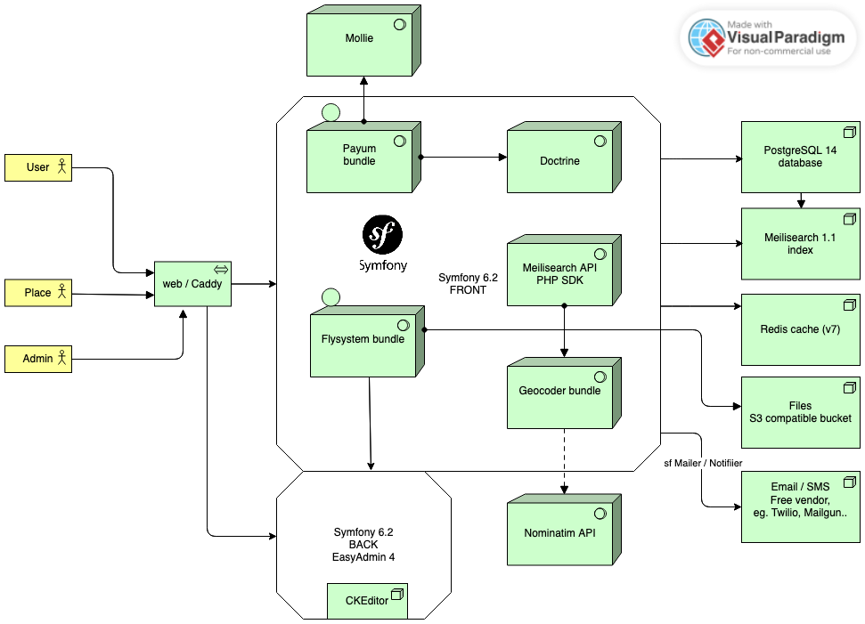

# Architecture

Here is the diagram of the global architecture, presenting the high level components
and their relations.

Check out the other documentation files for more details about a specific component.

