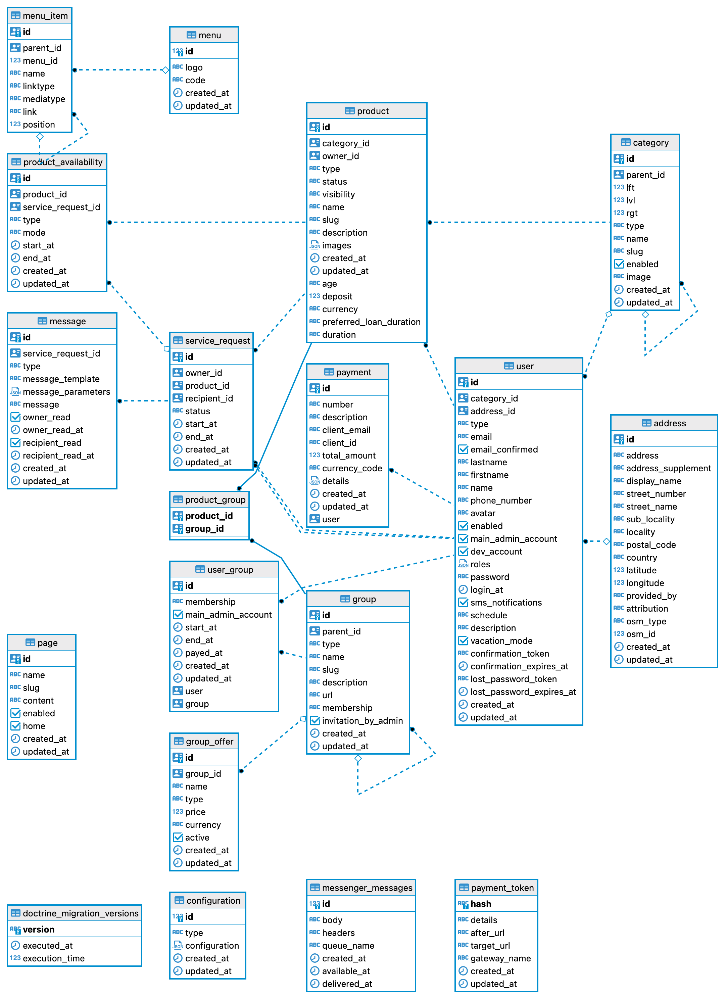
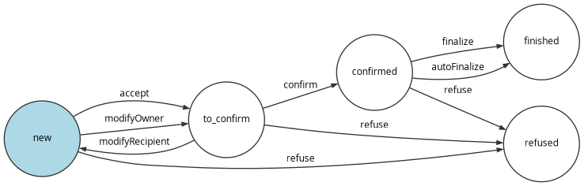

# Database


## Introduction

The database choosen is a Postgres 14 database as it integrates well with Symfony
and Doctrine.
When developping you can use the `make load-fixtures` command to reload a database
from scratch with some data samples.


## Docker

In the docker hub, the database is available with the `database` DSN.
Check out the default settings in the [docker-compose.yml](../docker-compose.yml)
file.


## Schema

Here is the current schema of the dabase:



It has 19 tables divided in several domains:

* users
* groups
* products
* service requests
* payments
* menu
* pages
* configuration

### Service requests

In this application, the technical name for loans and services (services are not related to objects)
are service requests.

Services requests are linked to products.

A product can be an object or a service.

The service requests follow a strict workflow in order to garantee the date integrity.

Here is the workflow in place:




### System tables

* The migrations are stored in the `doctrine_migration_table`.
* The messages are store in `messenger_messages`

Note that for now all messages are synchronous, but if you change to change
this for performance reasons, the messages will be stored in these tables ans then
processed by the messenger consumer.

Check out the [Symfony documention](https://symfony.com/doc/current/messenger.html#consuming-messages-running-the-worker)
on this subject.

It's up to your responsability to setup the CRON that will consume the asynchronous
messages.


## Doctrine

The description of each property/field is described in each entity:

Example:

```php
/**
 * A user must be enabled to be able to login. If a user tries to login with
 * a deactivated account, then he will have a specific message indicating
 * the reason he can't login. He should be adviced to contact the instance administrator.
 */
#[ORM\Column(type: 'boolean', nullable: false)]
protected bool $enabled = true;
```

So, open the entity Doctrine files in the [src/Entity](../src/Entity) directory 
to have the description of each property.


## Development

To access the database with a GUI, after running `make start` you can run 
`make start-dev` and enter http://localhost:8989/?pgsql=database&username=app&db=app&ns=public&dump=service_request
to access the adminer interface which is a small convenient tool to view the
tables and data they contain.


## Tests

Fixtures are loaded depending on the current environment.
In dev and test the same fixtures are loaded (`dev` is a symbolik link to `test`,
see [fixtures/](../fixtures).


## Production

A database with the minimal data to bootstrap the application is available.
It can be loaded with:

    make load-prod-fixtures

It should only be used one time, or if you want to reset the database for testing
purpose.
Use it with care as it will delete all existing data of the current configured database.


## Migrations

When the project will evolve, Doctrine migrations will be provided.
Retrieve the migrations in your project, then run:

    bin/console doctrine:migrations:migrate --env=prod

Use the `--no-interaction` option to skip the interactive mode.
Use this option with care. 

Migrations will be documented in each file in the main docblock, so open them to
precisely understand what will be modified.

Also understand, that depending on the cases, sometimes a migration cannot be undone.
It's your responsability to make a full backup of your data before running migrations.
